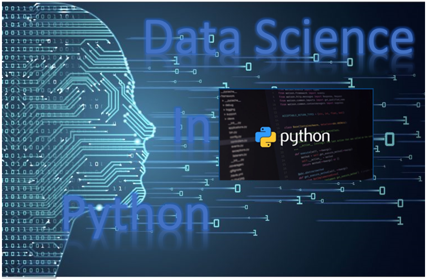
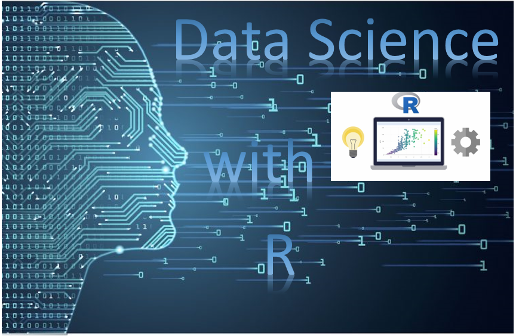

# 
 Kaggle-Project  
This a practice of writing codes using kaggle data and real world data. Also, is to learn to be a data scientists and expanding more knowledge in machine learning and deep learning.

# Prerequisites
Python 3.5

R 3.5.3 

### Learning about Exploratory Data Analysis 
* Import, clean, and validate  
  - Type of Data  
    1. Qualitative  
        - Discrete and Continuous  
    2. Quantitative   
        - Binary, nominal data, and ordinal data  
  - Type of data measusrements  
    1. Nominal  
    2. Ordinal  
    3. Interval  
* Visualize distributions  
  - Univariate visualization  
  - Bivariate visualization  
  - Multivariate visualization  
  - Dimensionality reduction  
* Explore relations between variables
  - Descriptive statistics  
  - Inferential statistics  
  - Statistical graphics  
* Explore multivariate relationships  
* Questions about data  
  - Do you have the right data for exploratory data anlaysis?  
  - Do you need other data?
  - Do you have the right question
### Learning to be Data Science  
* Choose Programming Language  
  - Python or R  
* Mathematics and Linear Algebra  
* Big Data  
* Data Visualization  
* Data Cleaning
* How to solve Problem?
* Machine Learning
  - Type of algorithms performs the learning  
  1. Supervised Learning  
  2. Unsupervised Learning    
  3. Semi-supervised Learning  
  4. Reinforcement Learning  
  - Common Machine Learning Algorithms
  1. Linear Regression  
  2. Logistic Regression  
  3. Decision Tree  
  4. SVM  
  5. Naive Bayes  
  6. kNN  
  7. K-Means  
  8. Random Forest  
  9. Dimensionality Reduction Algorithms  
  10. Gradient Boosting algorithms  
* Deep Learning
  - Common Library
  1. TensorFlow  
  2. Keras  
  3. Theano  
  4. Pytorch  
  5. sklearn  
  6. Caffe  
### Learning to improve the Model or Prediction
  - Improve the "Accuracy" of Machine Learning Model  
  1. Add More Data
  2. Add More Features
  3. Feature Engineering  
  4. Feature Selection  
  5. Use Regularization  
  6. Multiple Alogrithms  
  7. Ensemble Methods  
  8. Cross Validation  
  9. Algorithm Tuning
  10.  Bagging or Boosting  
