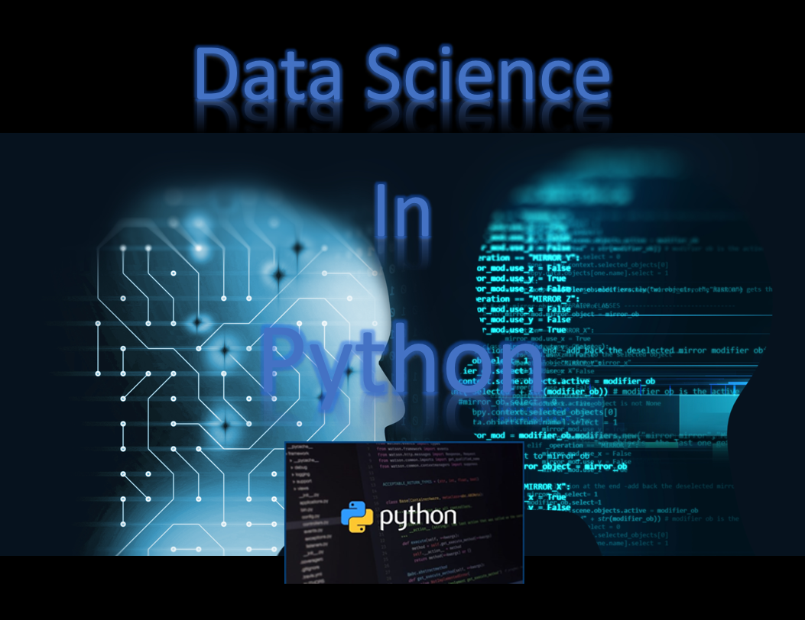

[![Contributors][contributors-shield]][contributors-url]
[![Forks][forks-shield]][forks-url]
[![Stargazers][stars-shield]][stars-url]
[![Issues][issues-shield]][issues-url]
[![MIT License][license-shield]][license-url]
[![LinkedIn][linkedin-shield]][linkedin-url]

<!-- MARKDOWN LINKS & IMAGES -->
<!-- https://www.markdownguide.org/basic-syntax/#reference-style-links -->
[contributors-shield]: https://img.shields.io/github/contributors/LastAncientOne/Data-Science.svg?style=for-the-badge
[contributors-url]: https://github.com/LastAncientOne/Data-Science/graphs/contributors
[forks-shield]: https://img.shields.io/github/forks/LastAncientOne/Data-Science.svg?style=for-the-badge
[forks-url]: https://github.com/LastAncientOne/Data-Science/network/members
[stars-shield]: https://img.shields.io/github/stars/LastAncientOne/Data-Science.svg?style=for-the-badge
[stars-url]: https://github.com/LastAncientOne/Data-Science/stargazers
[issues-shield]: https://img.shields.io/github/issues/LastAncientOne/Data-Science.svg?style=for-the-badge
[issues-url]: https://github.com/LastAncientOne/Data-Science/issues
[license-shield]: https://img.shields.io/github/license/LastAncientOne/Data-Science.svg?style=for-the-badge
[license-url]: LICENSE
[linkedin-shield]: https://img.shields.io/badge/-LinkedIn-black.svg?style=for-the-badge&logo=linkedin&colorB=555
[linkedin-url]: https://linkedin.com/in/tin-hang

| Programming Language and Software | Software Links |
| :--- | :--- |
| Data Science in Python | [Python](https://www.anaconda.com/products/distribution)|
| Data Science in R | [R](https://www.rstudio.com/)|
| Data Science in Excel | [Excel](https://www.microsoft.com/en-us/microsoft-365/excel)|
| Data Science in Power BI | [Power BI](https://powerbi.microsoft.com/en-us/downloads/)|
| Data Science in Tableau | [Tableau](https://www.tableau.com/support/releases)|

# Data Science  
Data Science is an interdisciplinary field that uses scientific methods, processes, algorithms and systems to extract knowledge and insights from structured and unstructured data, and qquantitative data and qualitative data. Apply knowledge and actionable insights from data across a broad range of application domains. (Wikipedia)

This is a practice of programming skills, and knowledge of mathematics and statistics to extract meaningful insights from structure and unstructured data (kaggle data and real world data). Learning step-by-step in data science. Learn analytical techniques, statistics, and research methods. The most common use used methods are Regression, Clustering, Visualization, Decision Trees/Rules, and Random Forest in data science. Learning the process in analyzing data in python, R, Excel, Power BI, and tableau. In addition, learn to become a data scientists and expanding more knowledge in machine learning and deep learning. Understanding data and analyzing data.

# Prerequisites
#### Python 3.5+  

#### R 3.5.3+   

#### Excel 2016+  

#### Power BI  

#### Tableau  

# &#x1F537; Getting Started with Data Science &#x1F537;
### &#x1F535; Step-by-Step to Data Science  
* Define Problem  
* Data Collection  
* Data Understanding    
* Data Analysis/Cleaning  
* Data Organization/Transformation  
* Data Validation/Anomaly Detection  
* Feature Engineering  
* Model Training  
* Model Evaluation/validation  
* Model Monitoring  
* Model Deployment  
* Data Drift/Model Drift  
* Reports  
### &#x1F535; Three Types of Position in Data Science  
* Data Engineer  
  - Develops, constructs, tests, and maintains architectures such as databases and large-scales processing systems.  
* Data Analyst  
  - Interprets data and turns data into information which can offer ways to improve business.  
  - Gather information from various sources and intrepret patterns and trends.  
* Machine Learning Scientist  
  - Research and developed algorithms.  
  - Predictions from data with labels and features.  
  - Create a predictive models.  

### &#x1F535; Types of Data Analysis: Techniques and Methods  
* Descriptive Analysis  
* Text Analysis  
* Statistical Analysis  
* Diagnostic Analysis  
* Predictive Analysis  
* Prescriptive Analysis   
  
### &#x1F535; Two Types of Data  
* Supervised Data (Data pre-categorized or numerical)  
  - Classification (Predict a category)  
  - Regression (Predict a number)  
* Unsupervised Data (Data is not labeled in any way)  
  - Clustering (Divide by similarity)  
  - Dimension Reduction (Generalization) - Find hidden dependencies    
  - Association (Identify Sequences)       
### &#x1F535; Learning about Exploratory Data Analysis 
* Import, read, clean, and validate  
  - Define Variables
    1. Y is "Dependent Variable" and goes on y-axis (the left side, vertical one) - output value
    2. X is "Independent Variable" and goes on the x-axis (the bottom, horizontal one) - input value
  - Type of Data  
    1. Quantitative
      - Ratio or Interval
        - Discrete and Continuous  
        Discrete variables can only take certain numerical values and are counted  
        Continuous variables can take any numerical value and are measured
    2. Qualitative  
      - Norminal or Ordinal
        - Binary, nominal data, and ordinal data  
        Categorical variables take category or label values and place an individual into one of several groups.
  - Type of data measurements 
    1. Nominal - names or labels variable  
    For example, gender: male and female. Other examples include eye colour and hair colour.  
    2. Ordinal - non-numeric concepts like satisfaction, happiness, discomfort, etc.  
    For example: is rating happiness on a scale of 1-10.  
    3. Interval - numeric scales in which we know both the order and the exact differences between the values  
    For example: interval data is temperature, the difference in temperature between 10-20 degrees is the same as the difference in temperature between 20-30 degrees.  Likert scale is type of data. Likert scale is composed of a series of four or more Likert-type items that represent similar questions combined into a single composite score/variable. Likert scale data can be analyzed as interval data, i.e. the mean is the best measure of central tendency. use means and standard deviations to describe the scale. For example, it is a rating scale, often found on survey forms, that measures how people feel about something. It includes a series of questions that you ask people to answer, and ideally 5-7 balanced responses people can choose from. It often comes with a neutral midpoint.  
    4. Ratio - measurement scales  
    For example: data it must have a true zero, meaning it is not possible to have negative values in ratio data. Ratio data is measurements of height be that centimetres, metres, inches or feet.  
    

    
* Visualize distributions  
  - Univariate visualization  
  - Bivariate visualization  
  - Multivariate visualization  
  - Dimensionality reduction  
* Explore relations between variables
  - Descriptive statistics  
  - Inferential statistics  
  - Statistical graphics  
* Explore multivariate relationships  
* Statistical Analysis
  - Cases, Variables, Types of Variables  
  - Matrix and Frequency Table  
  - Graphs and Shapes of Distributions  
  - Mode, Median and Mean  
  - Range, Interquartile Range and Box Plot  
  - Variance and Standard deviation  
  - Z-scores  
  - Contingency Table, Scatterplot, Pearson’s   
  - Basics of Regression  
  - Elementary Probability  
  - Random Variables and Probability Distributions  
  - Normal Distribution, Binomial Distribution & Poisson Distribution  
  - Hypothesis  
    3 Steps:     
     (1) Making an initial assumption.  
     (2) Collecting evidence (data).  
     (3) Based on the available evidence (data), deciding whether to reject or not reject the initial assumption.  

* Inferential Statistics  
  - Observational Studies and Experiments  
  - Sample and Population  
  - Population Distribution, Sample Distribution and Sampling Distribution  
  - Central Limit Theorem  
  - Point Estimates  
  - Confidence Intervals  
  - Introduction to Hypothesis Testing  
* Questions about data  
  - Do you have the right data for exploratory data anlaysis?  
  - Do you need other data?  
  - Do you have the right question?  
### &#x1F535; Learning to be Data Science  
* Choose Programming Language  
  - Python or R  
* Mathematics and Linear Algebra  
* Big Data  
* Data Visualization  
* Data Cleaning
* How to solve Problem?
* Machine Learning
  - Type of algorithms performs the learning  
  1. Supervised Learning
    - Dataset has labels
    * Classification    
      - Binary Classification  
      - Multiclass Classification  
      - Multilabel Classification  
    * Regression  
      - Linear Regression: Linear relationships between inputs and outputs  
      - Logistic Regression: Probability of a binary output  
  2. Unsupervised Learning    
    - Dataset is unlabeled
  3. Semi-supervised Learning 
    - Dataset contains labeled and unlabeled
  4. Reinforcement Learning  
    - Learns from mistakes
    - Agent take "actions" in an environment and see the "state" of environment with the features
    - Excute actions in every state with different actions bring different "rewards"
    - It learns "policy".
 - Common Machine Learning Algorithms
  1. Linear Regression  
  2. Logistic Regression  
  3. Decision Tree  
  4. SVM  
  5. Naive Bayes  
  6. kNN  
  7. K-Means  
  8. Random Forest  
  9. Dimensionality Reduction Algorithms  
  10. Gradient Boosting algorithms  
* Deep Learning
  - Common Library
  1. TensorFlow  
  2. Keras  
  3. Theano  
  4. Pytorch  
  5. sklearn  
  6. Caffe  
  7. Apache Spark  
  8. Chainer  
### &#x1F535; Underfitting and Overfitting  

#### Overfitting  
  1. Overfitting - the gap between training and test error is larger.  
  2. Overfitting - the training error is smaller than test error.
  3. Overfitting - the larger hypothesis space, there is a higher tendancy for the model to overfit the training dataset.  
  4. A model suffering from overfitting will have high variance and low bias.  
#### Fixing Overfitting  
  1. Simplify the model (fewer parameters)  
  2. Simplify training data (fewer attributes)  
  3. Constrain the model (regularization)  
  4. Use ccross-validation  
  5. Use Early stopping  
  6. Build an ensemble  
  7. Gather more data  
#### Underfitting  
  1. Underfitting - both the training and test error are larger.
  2. A model suffering from underfitting will have high bias and low variance.  
#### Fixing Underfitting  
  1. Increase model complexity (more parameters)  
  2. Increase number of features  
  3. Feature engineer should help  
  4. Un-constrain the model (no regularization)  
  5. Reduce or remove noise on the data  
  6. Train for longer  
### &#x1F535; Learning to improve the Model or Prediction  
  - Improve the "Accuracy" of Machine Learning Model  
  1. Add More Data
  2. Add More Features
  3. Feature Engineering  
  4. Feature Selection  
  5. Use Regularization  
  6. Multiple Alogrithms  
  7. Ensemble Methods  
  8. Cross Validation  
  9. Algorithm Tuning
  10. Bagging or Boosting  
  
  
# Author:
## Tin Hang

